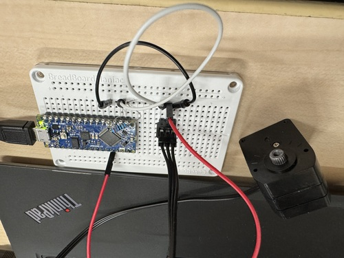

# Arduino Library for ICS (Kondo Servo)

[](https://github.com/iory/arduino-ics/actions)

This is a library for Kondo servos that supports Arduino and ESP with PlatformIO.
You can easily perform ICS communication and control Kondo servos with it.

## Quick Example

### Prerequirements

Install udev to give permission to the device.

```
curl -fsSL https://raw.githubusercontent.com/platformio/platformio-core/develop/platformio/assets/system/99-platformio-udev.rules | sudo tee /etc/udev/rules.d/99-platformio-udev.rules
sudo udevadm control --reload-rules
sudo udevadm trigger
```

Ubuntu/Debian users may need to add own “username” to the “dialout” group if they are not “root”, doing this issuing

```
sudo usermod -a -G dialout $USER
sudo usermod -a -G plugdev $USER
```

```
pip3 install platformio -U
```

### Compile and write firmware to arduino

Assign ID 0 to the Kondo servo and set the baud rate to 115200.
Please wire it as shown in the following photo. Connecting a 220Ω resistor to the RX and TX pins will work fine.



```
pio run -e example_rotate_nano_every -t upload
```

You should be able to confirm that the servo is rotating.

